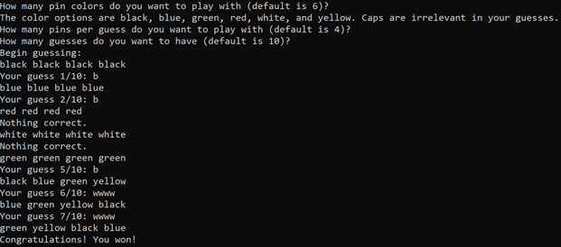
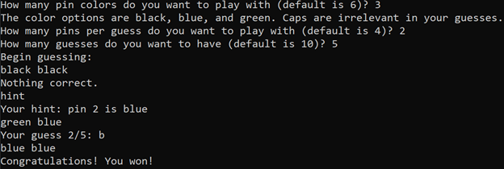

# MasterMind

## Table of Contents
- [MasterMind](#mastermind)
  - [Table of Contents](#table-of-contents)
  - [Description](#description)
      - [Programming language(s):](#programming-languages)
    - [Display](#display)
      - [Examples](#examples)
      - [UI](#ui)
    - [Folder structure](#folder-structure)
  - [Installation](#installation)
  - [Usage](#usage)
    - [Invokation](#invokation)
    - [Operation](#operation)
  - [Contributions](#contributions)

## Description
A computerized version of the board game Master Mind  
Start date: June 07, 2021  
Current version: 0.1.0  
#### Programming language(s):
- C++
	- [MasterMind/MasterMind.cpp](MasterMind/MasterMind.cpp)&mdash;main program entrance containing all pertinent code and structures

### Display
#### Examples

#### UI

### Folder structure
| Tree with Root Having Local Path | Generation Method | Description |
| -------------------------------- | ----------------- | ----------- |
| [https://github.com/anderjef/MasterMind](https://github.com/anderjef/MasterMind) | auto-generated by Visual Studio IDE | <!-- --> |
| [.github/](.github/) | <!-- --> | holds GitHub-specific documents |

## Installation
- Install [Visual Studio IDE](https://visualstudio.microsoft.com/downloads/) or some other IDE that supports C++14.
- Download [ZIP](https://github.com/anderjef/MasterMind/archive/main.zip). Extract to a folder named MasterMind.

## Usage
### Invokation
- See [Installation](#installation).
- Run the corresponding executable.

### Operation
FIXME: any necessary interaction/operation instructions (such as communicating through standard input)

## Contributions
- Jeffrey Andersen&mdash;developer
- An owned copy of the boardgame&mdash;inspiration
- [Rules](https://quarantinegames302883461.files.wordpress.com/2020/12/mastermind-instructions-pdf.pdf) except b (short for black) and w (short for white) are used for feedback in place of checks and circles respectively

For copyright, license, and warranty, see [LICENSE.md](LICENSE.md).